# OBS Polyemesis - Restreamer Control Plugin

[](LICENSE)
[](https://obsproject.com/)
[](https://github.com/rainmanjam/obs-polyemesis/actions/workflows/ci.yaml)
[](https://github.com/rainmanjam/obs-polyemesis/actions/workflows/security.yaml)
[](https://github.com/rainmanjam/obs-polyemesis/security/code-scanning)

A comprehensive OBS Studio plugin for controlling and monitoring [datarhei Restreamer](https://github.com/datarhei/restreamer) with advanced multistreaming capabilities including orientation-aware routing.

### 🔄 Architecture Overview

```mermaid
flowchart LR
    OBS[OBS Studio<br/>⚡ Polyemesis Plugin]
    API[datarhei Restreamer<br/>REST API]
    YT[📺 YouTube]
    TW[🎮 Twitch]
    TT[🎵 TikTok]
    IG[📷 Instagram]
    FB[👥 Facebook]

    OBS -->|Stream Control<br/>Process Management| API
    API -->|Monitoring<br/>Stats & Logs| OBS
    API -->|Horizontal 16:9| YT
    API -->|Horizontal 16:9| TW
    API -->|Vertical 9:16| TT
    API -->|Vertical 9:16| IG
    API -->|Auto-detect| FB

    style OBS fill:#5865F2,stroke:#4752C4,color:#fff
    style API fill:#00A8E8,stroke:#0077B6,color:#fff
    style YT fill:#FF0000,stroke:#CC0000,color:#fff
    style TW fill:#9146FF,stroke:#772CE8,color:#fff
    style TT fill:#000000,stroke:#69C9D0,color:#fff
    style IG fill:#E4405F,stroke:#C13584,color:#fff
    style FB fill:#1877F2,stroke:#0C5DBD,color:#fff
```



### 🔧 Detailed Component Interaction

```mermaid
sequenceDiagram
    participant User
    participant OBS as OBS Studio
    participant Plugin as Polyemesis Plugin
    participant Config as Configuration Manager
    participant API as Restreamer API
    participant Multi as Multistream Manager
    participant Platform as Streaming Platforms

    User->>OBS: Start Streaming
    OBS->>Plugin: Initialize Output
    Plugin->>Config: Load Connection Settings
    Config-->>Plugin: Connection Details

    Plugin->>API: Test Connection
    API-->>Plugin: Connection OK

    Plugin->>API: Detect Video Orientation<br/>(16:9, 9:16, 1:1)
    API-->>Plugin: Orientation Confirmed

    Plugin->>Multi: Configure Destinations
    Multi->>Multi: Apply Service Rules<br/>(YouTube→16:9, TikTok→9:16)

    Plugin->>API: Create Restream Process
    API-->>Plugin: Process Created (ID)

    loop Streaming Active
        OBS->>Plugin: Video/Audio Data
        Plugin->>API: Forward Stream
        API->>Multi: Distribute to Destinations
        Multi->>Platform: YouTube (Horizontal)
        Multi->>Platform: Twitch (Horizontal)
        Multi->>Platform: TikTok (Vertical)
        Multi->>Platform: Instagram (Vertical)

        API->>Plugin: Status Update<br/>(CPU, Memory, Uptime)
        Plugin->>OBS: Update UI Stats
        OBS->>User: Display Monitoring
    end

    User->>OBS: Stop Streaming
    OBS->>Plugin: Shutdown Output
    Plugin->>API: Stop Restream Process
    API-->>Plugin: Process Stopped
    Plugin->>OBS: Cleanup Complete
```



## ✨ Key Features

- 🎮 **Complete Restreamer Control**: Manage processes, monitor stats, view logs
- 📺 **Multiple Plugin Types**: Source, Output, and Dock UI
- 🌐 **Advanced Multistreaming**: Stream to multiple platforms simultaneously
- 📱 **Orientation-Aware**: Automatically route horizontal/vertical streams correctly
- 🎯 **Service-Specific Routing**: Pre-configured for Twitch, YouTube, TikTok, Instagram, and more
- 📊 **Real-time Monitoring**: CPU, memory, uptime, and session tracking
- ⚡ **Smart Transcoding**: Automatic video conversion between orientations
- 🎨 **Native OBS Theme Integration**: Seamlessly matches all 6 OBS themes (Yami, Grey, Acri, Dark, Rachni, Light)
- 📱 **Modern Collapsible UI**: Clean, organized interface with collapsible sections and quick action buttons
- 🌍 **Cross-Platform**: Universal binaries for macOS (Intel + Apple Silicon), Windows x64, Linux x64/ARM64

## 🚀 Quick Start

### Installation

#### Pre-built Packages (Recommended)

Download the latest release for your platform from the [Releases page](https://github.com/rainmanjam/obs-polyemesis/releases):

**macOS** (Universal Binary - Apple Silicon + Intel)
```bash
# Download obs-polyemesis-X.X.X-macos-universal.pkg
# Right-click → Open (or double-click)
# If blocked: System Settings → Privacy & Security → "Open Anyway"
```
> ⚠️ **Note**: Packages are unsigned. The plugin installs to `~/Library/Application Support/obs-studio/plugins/`
>
> ✨ **Universal Binary**: Single installer works on both Intel and Apple Silicon Macs

**Windows** (x64)
```bash
# Download obs-polyemesis-X.X.X-windows-x64.exe
# Run installer
```

**Linux** (Ubuntu/Debian)
```bash
# x86_64
sudo dpkg -i obs-polyemesis_X.X.X_amd64.deb

# ARM64 (Raspberry Pi, ARM servers)
sudo dpkg -i obs-polyemesis_X.X.X_arm64.deb
```

#### Build from Source

```bash
# Clone the repository
git clone https://github.com/rainmanjam/obs-polyemesis.git
cd obs-polyemesis

# Build (macOS universal binary)
cmake -B build -DCMAKE_BUILD_TYPE=Release \
  -DCMAKE_OSX_ARCHITECTURES="arm64;x86_64"
cmake --build build --config Release

# Install
cmake --install build
```

### First Use

1. Open OBS Studio
2. Go to View → Docks → Restreamer Control
3. Configure your restreamer connection (host, port)
4. Click "Test Connection"
5. Start controlling your restreamer processes!

## 📖 Documentation

### User Documentation
- **[User Guide](docs/USER_GUIDE.md)** - Installation, setup, and usage instructions
- **[Building](docs/BUILDING.md)** - Build instructions for all platforms
- **[Deployment Guide](docs/DEPLOYMENT_GUIDE.md)** - Deployment and distribution

### Architecture & Design
- **[Output Profiles](docs/architecture/OUTPUT_PROFILES.md)** - Multi-stream profile management
- **[Cross-Platform Status](docs/architecture/CROSS_PLATFORM_STATUS.md)** - Platform compatibility

### API Documentation
- **[API Gap Analysis](docs/api/API_GAP_ANALYSIS.md)** - Restreamer Core API coverage
- **[WebSocket API](docs/api/WEBSOCKET_API.md)** - WebSocket integration
- **[Platform API Integration Plan](docs/api/PLATFORM_API_INTEGRATION_PLAN.md)** - Platform integration roadmap

### Developer Documentation
- **[Contributing](CONTRIBUTING.md)** - Development workflow and contribution guidelines
- **[Plugin Documentation](docs/developer/PLUGIN_DOCUMENTATION.md)** - Feature descriptions and API reference
- **[Code Style](docs/developer/CODE_STYLE.md)** - Coding standards
- **[Apple Code Signing](docs/developer/APPLE_CODE_SIGNING_SETUP.md)** - macOS signing setup
- **[ACT Testing](docs/developer/ACT_TESTING.md)** - Local CI/CD testing
- **[Quality Assurance](docs/developer/QUALITY_ASSURANCE.md)** - QA processes

### Testing Documentation
- **[Testing Plan](docs/testing/TESTING_PLAN.md)** - Comprehensive testing strategy
- **[Test Results](docs/testing/TEST_RESULTS.md)** - Test execution results
- **[Automation Analysis](docs/testing/AUTOMATION_ANALYSIS.md)** - Test automation capabilities

### CI/CD & Releases
- **[CI/CD Workflow](docs/cicd/CICD_WORKFLOW.md)** - Pipeline architecture and automation
- **[Quick Release Guide](docs/releases/QUICK_RELEASE_GUIDE.md)** - Release process
- **[Release Summaries](docs/releases/)** - Version-specific release notes

### Planning & Compliance
- **[Improvements Roadmap](docs/planning/IMPROVEMENTS.md)** - Future enhancements
- **[Compliance Review](docs/compliance/COMPLIANCE_REVIEW.md)** - Security and compliance

## 🎯 Use Cases

### Portrait Mobile Streaming
Stream vertical 9:16 content to TikTok, Instagram, while automatically converting to horizontal for Twitch and YouTube.

### Multi-Platform Gaming
Stream landscape gameplay to Twitch and YouTube in native 16:9, with automatic cropping for vertical platforms.

### Universal Broadcasting
One OBS setup, multiple platforms, correct orientations - automatically.

## ⚠️ Known Limitations

- **macOS**: Apple Silicon only (Intel Macs not supported in 0.9.0)
- **macOS**: Unsigned packages show security warning (right-click → Open to install)
- **Requires datarhei Restreamer instance** (tested with v16.16.0)

## 🛠️ Requirements

- **OBS Studio**: 28.0 or later
- **datarhei Restreamer**: Running instance (local or remote)
- **Dependencies**:
  - libcurl
  - jansson
  - Qt6

## 🤝 Contributing

We welcome contributions! Please see our [Contributing Guide](CONTRIBUTING.md) for details on:
- Development workflow (GitHub Flow)
- Code quality standards
- Testing requirements
- Pull request process

## 📝 License

GNU General Public License v2.0 or later - see [LICENSE](LICENSE) for details.

## 🙏 Credits

- [OBS Studio](https://obsproject.com/)
- [datarhei Restreamer](https://github.com/datarhei/restreamer)
- [OBS Plugin Template](https://github.com/obsproject/obs-plugintemplate)

## 📞 Support

- **Issues**: [GitHub Issues](https://github.com/rainmanjam/obs-polyemesis/issues)
- **Restreamer Docs**: [docs.datarhei.com/restreamer](https://docs.datarhei.com/restreamer/)

---

**Built with ❤️ for the streaming community**
