# OBS Polyemesis - Restreamer Control Plugin

[](LICENSE)
[](https://github.com/rainmanjam/obs-polyemesis/releases)
[](https://obsproject.com/)
[](https://github.com/datarhei/restreamer)
[](https://github.com/rainmanjam/obs-polyemesis/actions/workflows/ci.yaml)
[](https://github.com/rainmanjam/obs-polyemesis/actions/workflows/run-tests.yaml)
[](https://codecov.io/gh/rainmanjam/obs-polyemesis)
[](https://github.com/rainmanjam/obs-polyemesis/actions/workflows/security.yaml)
[](https://github.com/rainmanjam/obs-polyemesis/security/code-scanning)

A comprehensive OBS Studio plugin for controlling and monitoring [datarhei Restreamer](https://github.com/datarhei/restreamer) with advanced multistreaming capabilities, JWT authentication support, and orientation-aware routing for seamless multi-platform streaming.

### 🔄 Architecture Overview

```mermaid
flowchart LR
    OBS[OBS Studio<br/>⚡ Polyemesis Plugin]
    API[datarhei Restreamer<br/>REST API]
    YT[📺 YouTube]
    TW[🎮 Twitch]
    TT[🎵 TikTok]
    IG[📷 Instagram]
    FB[👥 Facebook]

    OBS -->|Stream Control<br/>Process Management| API
    API -->|Monitoring<br/>Stats & Logs| OBS
    API -->|Horizontal 16:9| YT
    API -->|Horizontal 16:9| TW
    API -->|Vertical 9:16| TT
    API -->|Vertical 9:16| IG
    API -->|Auto-detect| FB

    style OBS fill:#5865F2,stroke:#4752C4,color:#fff
    style API fill:#00A8E8,stroke:#0077B6,color:#fff
    style YT fill:#FF0000,stroke:#CC0000,color:#fff
    style TW fill:#9146FF,stroke:#772CE8,color:#fff
    style TT fill:#000000,stroke:#69C9D0,color:#fff
    style IG fill:#E4405F,stroke:#C13584,color:#fff
    style FB fill:#1877F2,stroke:#0C5DBD,color:#fff
```



### 🔧 Detailed Component Interaction

```mermaid
sequenceDiagram
    participant User
    participant OBS as OBS Studio
    participant Plugin as Polyemesis Plugin
    participant Config as Configuration Manager
    participant API as Restreamer API
    participant Multi as Multistream Manager
    participant Platform as Streaming Platforms

    User->>OBS: Start Streaming
    OBS->>Plugin: Initialize Output
    Plugin->>Config: Load Connection Settings
    Config-->>Plugin: Connection Details

    Plugin->>API: Test Connection
    API-->>Plugin: Connection OK

    Plugin->>API: Detect Video Orientation<br/>(16:9, 9:16, 1:1)
    API-->>Plugin: Orientation Confirmed

    Plugin->>Multi: Configure Destinations
    Multi->>Multi: Apply Service Rules<br/>(YouTube→16:9, TikTok→9:16)

    Plugin->>API: Create Restream Process
    API-->>Plugin: Process Created (ID)

    loop Streaming Active
        OBS->>Plugin: Video/Audio Data
        Plugin->>API: Forward Stream
        API->>Multi: Distribute to Destinations
        Multi->>Platform: YouTube (Horizontal)
        Multi->>Platform: Twitch (Horizontal)
        Multi->>Platform: TikTok (Vertical)
        Multi->>Platform: Instagram (Vertical)

        API->>Plugin: Status Update<br/>(CPU, Memory, Uptime)
        Plugin->>OBS: Update UI Stats
        OBS->>User: Display Monitoring
    end

    User->>OBS: Stop Streaming
    OBS->>Plugin: Shutdown Output
    Plugin->>API: Stop Restream Process
    API-->>Plugin: Process Stopped
    Plugin->>OBS: Cleanup Complete
```



## ✨ Key Features

### Core Functionality
- 🎮 **Complete Restreamer Control**: Manage processes, monitor stats, view logs
- 🔐 **JWT Authentication**: Secure API v3 authentication with automatic token refresh
- 📺 **Multiple Plugin Types**: Source, Output, and Dock UI
- 🌐 **Advanced Multistreaming**: Stream to multiple platforms simultaneously
- 📱 **Orientation-Aware Routing**: Automatically route horizontal (16:9) and vertical (9:16) streams correctly
- 🎯 **Service-Specific Routing**: Pre-configured for Twitch, YouTube, TikTok, Instagram, Kick, and Facebook
- 📊 **Real-time Monitoring**: CPU, memory, uptime, and session tracking
- ⚡ **Smart Transcoding**: Automatic video conversion between orientations

### User Interface
- 🎨 **Native OBS Theme Integration**: Seamlessly matches all 6 OBS themes (Yami, Grey, Acri, Dark, Rachni, Light)
- 📱 **Modern Tabbed UI**: Clean, organized interface with Connection, Profiles, and Multistream tabs
- ⌨️ **Global Hotkeys**: Start/stop all profiles, control horizontal/vertical streams via keyboard shortcuts
- 🛠️ **Tools Menu Integration**: Quick access to common actions from OBS Tools menu

### Platform Support
- 🌍 **Cross-Platform**: Universal binaries for macOS (Intel + Apple Silicon), Windows x64, Linux x64/ARM64
- 🌐 **Internationalization**: 11 languages supported (English, Japanese, Korean, Chinese (Simplified & Traditional), Spanish, Portuguese, German, French, Russian, Italian)
- 🔄 **Auto-Start Profiles**: Automatically start/stop streams when OBS starts streaming

## 🆕 What's New in v0.9.0

### Major Features
- ✅ **Restreamer API v3 Support** with JWT authentication and automatic token refresh
- ✅ **Modern Tabbed UI** - Reorganized interface with Connection, Profiles, and Multistream tabs
- ✅ **Global Hotkeys** - Control streaming from anywhere (start/stop all, horizontal/vertical profiles)
- ✅ **Tools Menu Integration** - Quick access from OBS Tools menu
- ✅ **11-Language Support** - Internationalization infrastructure ready (AI-translated, community refinement welcome)
- ✅ **Universal macOS Binary** - Single installer for both Intel and Apple Silicon

### Technical Improvements
- ✅ **Comprehensive Test Suite** - 79 unit tests (56 C + 23 Qt) with automated coverage reporting
- ✅ **Automated CI/CD** - Full build, test, and security scan pipeline with multi-platform support
- ✅ **Code Quality** - clang-format, cppcheck, CodeQL, SonarCloud integration
- ✅ **Memory Safety** - Valgrind testing and RAII wrappers for OBS objects
- ✅ **Documentation** - Extensive developer and user documentation

### Known Issues Fixed
- ✅ Fixed CURL state management for HTTP method switching
- ✅ Fixed Content-Length issues in mock server
- ✅ Fixed Qt6 compatibility across all platforms
- ✅ Fixed type conversion warnings on Windows and Ubuntu
- ✅ Fixed memory management in API client

## 🚀 Quick Start

### Installation

#### Pre-built Packages (Recommended)

Download the latest release for your platform from the [Releases page](https://github.com/rainmanjam/obs-polyemesis/releases):

**macOS** (Universal Binary - Apple Silicon + Intel)
```bash
# Download obs-polyemesis-X.X.X-macos-universal.pkg
# Right-click → Open (or double-click)
# If blocked: System Settings → Privacy & Security → "Open Anyway"
```
> ⚠️ **Note**: Packages are unsigned. The plugin installs to `~/Library/Application Support/obs-studio/plugins/`
>
> ✨ **Universal Binary**: Single installer works on both Intel and Apple Silicon Macs

**Windows** (x64)
```bash
# Download obs-polyemesis-X.X.X-windows-x64.exe
# Run installer
```

**Linux** (Ubuntu/Debian)
```bash
# x86_64
sudo dpkg -i obs-polyemesis_X.X.X_amd64.deb

# ARM64 (Raspberry Pi, ARM servers)
sudo dpkg -i obs-polyemesis_X.X.X_arm64.deb
```

#### Build from Source

See the [Building Guide](docs/BUILDING.md) for comprehensive build instructions for all platforms.

Quick build (macOS universal binary):
```bash
# Clone the repository
git clone https://github.com/rainmanjam/obs-polyemesis.git
cd obs-polyemesis

# Build
cmake -G Xcode -B build -DCMAKE_BUILD_TYPE=Release \
  -DCMAKE_OSX_ARCHITECTURES="arm64;x86_64"
cmake --build build --config Release

# Install
cmake --install build
```

### First Use

1. Open OBS Studio
2. Go to View → Docks → Restreamer Control
3. Click the **Configure** button in the connection status bar
4. Enter your Restreamer URL (e.g., `https://rs.example.com` or `http://localhost:8080`)
   - **Tip**: Include the port number if not using standard ports (80/443)
   - The dialog will automatically test the connection if settings are already saved
5. Enter your username and password (if authentication is enabled)
6. Click **Test Connection** to verify connectivity
7. Click **Save** to store your settings
8. Start controlling your restreamer processes!

## 📖 Documentation

### User Documentation
- **[User Guide](docs/USER_GUIDE.md)** - Installation, setup, and usage instructions
- **[Building](docs/BUILDING.md)** - Build instructions for all platforms
- **[Deployment Guide](docs/DEPLOYMENT_GUIDE.md)** - Deployment and distribution
- **[Release Notes](docs/RELEASE_NOTES.md)** - Version history and changes
- **[Localization Guide](docs/LOCALIZATION.md)** - Translating the plugin (11 languages supported)

### Testing Documentation
- **[Comprehensive Testing Guide](docs/testing/COMPREHENSIVE_TESTING_GUIDE.md)** - Complete testing infrastructure and execution
- **[Testing Summary](docs/testing/TESTING_SUMMARY.md)** - Test suite details (56+ unit tests)
- **[Testing Plan](docs/testing/TESTING_PLAN.md)** - Testing strategy and coverage
- **[Test Results](docs/testing/TEST_RESULTS.md)** - Historical test results and metrics

### Developer Documentation
- **[Contributing Guide](CONTRIBUTING.md)** - Development workflow and contribution guidelines
- **[Plugin Documentation](docs/developer/PLUGIN_DOCUMENTATION.md)** - Feature descriptions and API reference
- **[Code Style](docs/developer/CODE_STYLE.md)** - Coding standards and formatting
- **[ACT Testing](docs/developer/ACT_TESTING.md)** - Local CI/CD testing with act
- **[Windows Testing](docs/developer/WINDOWS_TESTING.md)** - Remote Windows testing with SSH
- **[Quality Assurance](docs/developer/QUALITY_ASSURANCE.md)** - QA processes and checklists
- **[Apple Code Signing](docs/developer/APPLE_CODE_SIGNING_SETUP.md)** - macOS signing and notarization

### Architecture & API
- **[Output Profiles](docs/architecture/OUTPUT_PROFILES.md)** - Multi-stream profile management architecture
- **[Cross-Platform Status](docs/architecture/CROSS_PLATFORM_STATUS.md)** - Platform compatibility matrix
- **[WebSocket API](docs/api/WEBSOCKET_API.md)** - WebSocket integration (planned)
- **[API Gap Analysis](docs/api/API_GAP_ANALYSIS.md)** - Restreamer Core API v3 coverage

### CI/CD & Releases
- **[CI/CD Workflow](docs/cicd/CICD_WORKFLOW.md)** - Pipeline architecture and automation
- **[Quick Release Guide](docs/releases/QUICK_RELEASE_GUIDE.md)** - Step-by-step release process

### Compliance & Security
- **[Compliance Review](docs/compliance/COMPLIANCE_REVIEW.md)** - Security audit and compliance status

## 🎯 Use Cases

### Portrait Mobile Streaming
Stream vertical 9:16 content to TikTok, Instagram, while automatically converting to horizontal for Twitch and YouTube.

### Multi-Platform Gaming
Stream landscape gameplay to Twitch and YouTube in native 16:9, with automatic cropping for vertical platforms.

### Universal Broadcasting
One OBS setup, multiple platforms, correct orientations - automatically.

## ⚠️ Known Limitations

- **macOS**: Unsigned packages show security warning on first launch
  - **Workaround**: Right-click → Open, or System Settings → Privacy & Security → "Open Anyway"
- **Requires datarhei Restreamer instance** running with API v3 support
  - Tested with datarhei Restreamer v16.16.0
  - API v3 required for JWT authentication
- **WebSocket API**: Planned for future release (code prepared, headers pending)
- **Localization**: All non-English translations are AI-generated and may need refinement

## 🛠️ Requirements

### OBS Studio Version Compatibility

| Platform | Minimum Version | Tested Versions | Status |
|----------|----------------|-----------------|--------|
| **macOS** (Universal) | 28.0 | 32.0.2 | ✅ Verified |
| **Windows** (x64) | 28.0 | 32.0.2 | ✅ Verified |
| **Linux** (x64/ARM64) | 28.0 | 30.0.2, 32.0.2 | ✅ Verified |

- **Recommended**: OBS Studio 32.0.2 or later
- **Minimum**: OBS Studio 28.0
- **Note**: Plugin is compatible with OBS versions 28.x through 32.x+

### Restreamer Requirements

- **datarhei Restreamer**: Running instance with API v3 support
  - Minimum: v16.16.0 or later
  - Can be local (localhost) or remote
  - Must have JWT authentication enabled for secure connections

### Build Dependencies

For building from source, you'll need:
- **libcurl**: For HTTPS API communication
- **jansson**: For JSON parsing
- **Qt6**: For UI components (optional, controlled by `ENABLE_QT` flag)
- **CMake**: 3.28 or later
- **Platform-specific toolchains**:
  - **macOS**: Xcode 14+ with Command Line Tools
  - **Windows**: Visual Studio 2022 (Community Edition or higher)
  - **Linux**: GCC 9+ or Clang 10+, pkg-config

## 🤝 Contributing

We welcome contributions! Please see our [Contributing Guide](CONTRIBUTING.md) for details on:
- Development workflow (GitHub Flow)
- Code quality standards
- Testing requirements
- Pull request process

## 📝 License

GNU General Public License v2.0 or later - see [LICENSE](LICENSE) for details.

## 🙏 Credits

- [OBS Studio](https://obsproject.com/)
- [datarhei Restreamer](https://github.com/datarhei/restreamer)
- [OBS Plugin Template](https://github.com/obsproject/obs-plugintemplate)

## 📞 Support

- **Issues**: [GitHub Issues](https://github.com/rainmanjam/obs-polyemesis/issues)
- **Restreamer Docs**: [docs.datarhei.com/restreamer](https://docs.datarhei.com/restreamer/)

---

**Built with ❤️ for the streaming community**
