# OBS Polyemesis - User Journey Flowchart

## Complete User Interaction Flow

```mermaid
flowchart TD
    Start([User Opens OBS Studio]) --> LoadPlugin[OBS Loads Polyemesis Plugin]
    LoadPlugin --> DockVisible{Polyemesis Dock<br/>Visible?}

    DockVisible -->|No| OpenDock[User Opens Polyemesis<br/>from View Menu]
    DockVisible -->|Yes| CheckConnection{Connected to<br/>Restreamer?}
    OpenDock --> CheckConnection

    CheckConnection -->|No| ConfigConnection[Click 'Configure Connection']
    CheckConnection -->|Yes| ViewProfiles[View Profile List]

    ConfigConnection --> ConnDialog[Connection Config Dialog]
    ConnDialog --> EnterURL[Enter Restreamer URL]
    EnterURL --> EnterCreds[Enter Username/Password]
    EnterCreds --> TestConn[Click 'Test Connection']

    TestConn --> ConnResult{Connection<br/>Successful?}
    ConnResult -->|No| ShowError[Show Error Message<br/>with Hints]
    ShowError --> FixConn[User Fixes Connection<br/>Details]
    FixConn --> TestConn

    ConnResult -->|Yes| SaveConn[Click 'Save']
    SaveConn --> ViewProfiles

    ViewProfiles --> ProfileAction{User Action}

    ProfileAction -->|Create New| CreateProfile[Click 'Add Profile' Button]
    ProfileAction -->|Edit Existing| EditProfile[Right-click Profile<br/>→ Edit Profile]
    ProfileAction -->|View Stats| ViewStats[Right-click Profile<br/>→ View Statistics]
    ProfileAction -->|Export Config| ExportConfig[Right-click Profile<br/>→ Export Configuration]
    ProfileAction -->|Start Profile| StartProfile[Click Profile<br/>Start Button]
    ProfileAction -->|Stop Profile| StopProfile[Click Profile<br/>Stop Button]
    ProfileAction -->|Delete Profile| DeleteProfile[Right-click Profile<br/>→ Delete]

    CreateProfile --> ProfileDialog[Profile Edit Dialog]
    EditProfile --> ProfileDialog

    ProfileDialog --> SetName[Set Profile Name]
    SetName --> SetOrientation[Set Source Orientation<br/>Auto/Horizontal/Vertical/Square]
    SetOrientation --> SetDimensions[Set Source Dimensions<br/>or Auto-detect]
    SetDimensions --> SetInputURL[Optional: Set Input URL]
    SetInputURL --> ConfigStreaming[Configure Streaming Settings]

    ConfigStreaming --> AutoStart[Enable/Disable Auto-Start]
    AutoStart --> AutoReconnect[Configure Auto-Reconnect<br/>Delay & Max Attempts]
    AutoReconnect --> HealthMonitor[Configure Health Monitoring<br/>Interval & Threshold]
    HealthMonitor --> SaveProfile[Click 'Save']
    SaveProfile --> ViewProfiles

    StartProfile --> AddDestination{Profile Has<br/>Destinations?}
    AddDestination -->|No| NeedDest[Must Add Destinations First]
    NeedDest --> AddDest[Click 'Add Destination']
    AddDestination -->|Yes| ProfileStarting[Profile Status: Starting]

    AddDest --> DestDialog[Add Destination Dialog]
    DestDialog --> SelectService[Select Streaming Service<br/>YouTube/Twitch/Facebook/Custom]
    SelectService --> EnterKey[Enter Stream Key]
    EnterKey --> SetDestSettings[Configure Destination Settings<br/>Resolution/Bitrate/FPS]
    SetDestSettings --> SaveDest[Save Destination]
    SaveDest --> ProfileStarting

    ProfileStarting --> StartingDests[Starting All Destinations]
    StartingDests --> DestsActive[All Destinations Active]
    DestsActive --> StreamingState[Profile Status: Active<br/>Streams Running]

    StreamingState --> MonitorAction{Monitoring<br/>Action}

    MonitorAction -->|View Dest Details| ExpandDest[Click Destination<br/>Expand Arrow]
    MonitorAction -->|Check Stats| QuickStats[View Real-time Stats<br/>Bitrate/Dropped/Duration]
    MonitorAction -->|Restart Dest| RestartDest[Right-click Destination<br/>→ Restart Stream]
    MonitorAction -->|Stop Specific| StopDest[Right-click Destination<br/>→ Stop Stream]
    MonitorAction -->|Copy URL| CopyURL[Right-click Destination<br/>→ Copy Stream URL]
    MonitorAction -->|System Monitor| SysMonitor[Click 'Monitoring' Button]

    ExpandDest --> DetailedStats[View Detailed Statistics<br/>Network/Connection/Health/Failover/Encoding]
    DetailedStats --> StreamingState

    QuickStats --> StreamingState
    RestartDest --> StreamingState
    StopDest --> StreamingState
    CopyURL --> StreamingState

    SysMonitor --> MonitorDash[System Monitoring Dashboard<br/>All Profiles/Destinations<br/>Total Data/Connection Status]
    MonitorDash --> StreamingState

    ViewStats --> StatsDialog[Profile Statistics Dialog<br/>Status/Source/Destinations<br/>Totals/Settings]
    StatsDialog --> ViewProfiles

    ExportConfig --> ExportDialog[Save Configuration Dialog]
    ExportDialog --> SelectLocation[Choose Save Location]
    SelectLocation --> SaveJSON[Save as JSON File]
    SaveJSON --> ViewProfiles

    StopProfile --> ProfileStopping[Profile Status: Stopping]
    ProfileStopping --> StopAllDests[Stopping All Destinations]
    StopAllDests --> ProfileInactive[Profile Status: Inactive]
    ProfileInactive --> ViewProfiles

    DeleteProfile --> ConfirmDelete{Confirm<br/>Deletion?}
    ConfirmDelete -->|Yes| RemoveProfile[Remove Profile from List]
    ConfirmDelete -->|No| ViewProfiles
    RemoveProfile --> ViewProfiles

    ViewProfiles --> AdvancedFeatures{Advanced<br/>Features}

    AdvancedFeatures -->|View Config| ViewConfigDlg[View Restreamer Configuration<br/>Server/Profiles/Templates]
    AdvancedFeatures -->|View Skills| ViewSkillsDlg[View Server Capabilities<br/>FFmpeg/RTMP/SRT/HLS/Hardware]
    AdvancedFeatures -->|View Metrics| ViewMetricsDlg[View System Metrics<br/>Active Streams/Data/Dropped]
    AdvancedFeatures -->|Probe Input| ProbeInputDlg[Input Probing Info<br/>Codec/Resolution/Bitrate]
    AdvancedFeatures -->|Reload Config| ReloadConfigDlg[Reload All Profiles<br/>from Server]
    AdvancedFeatures -->|View SRT| ViewSRTDlg[View SRT Streams<br/>Count/Details]
    AdvancedFeatures -->|View RTMP| ViewRTMPDlg[View RTMP Streams<br/>List/Count]
    AdvancedFeatures -->|Settings| SettingsDlg[View Global Settings<br/>Server Config]
    AdvancedFeatures -->|Advanced| AdvancedDlg[Advanced Settings<br/>Future Features]

    ViewConfigDlg --> ViewProfiles
    ViewSkillsDlg --> ViewProfiles
    ViewMetricsDlg --> ViewProfiles
    ProbeInputDlg --> ViewProfiles
    ReloadConfigDlg --> RefreshAll[Refresh All Profiles]
    RefreshAll --> ViewProfiles
    ViewSRTDlg --> ViewProfiles
    ViewRTMPDlg --> ViewProfiles
    SettingsDlg --> ViewProfiles
    AdvancedDlg --> ViewProfiles

    ViewProfiles --> OBSAction{OBS Streaming<br/>Action}

    OBSAction -->|Start Streaming| OBSStart[User Starts OBS Streaming]
    OBSAction -->|Stop Streaming| OBSStop[User Stops OBS Streaming]

    OBSStart --> AutoStartCheck{Profiles with<br/>Auto-Start?}
    AutoStartCheck -->|Yes| AutoStartProfiles[Auto-start Enabled Profiles]
    AutoStartCheck -->|No| ManualStart[Manually Start Profiles]
    AutoStartProfiles --> AllActive[All Auto-start Profiles Active]
    ManualStart --> ViewProfiles
    AllActive --> StreamingState

    OBSStop --> AutoStopCheck{Auto-stop<br/>Profiles?}
    AutoStopCheck -->|Yes| AutoStopProfiles[Stop All Active Profiles]
    AutoStopCheck -->|No| KeepStreaming[Profiles Continue Streaming]
    AutoStopProfiles --> ViewProfiles
    KeepStreaming --> StreamingState

    StreamingState -->|User Closes OBS| Cleanup[Cleanup & Save State]
    ViewProfiles -->|User Closes OBS| Cleanup
    Cleanup --> End([End Session])

    style Start fill:#e1f5e1
    style End fill:#ffe1e1
    style ConnDialog fill:#e1e5ff
    style ProfileDialog fill:#e1e5ff
    style DestDialog fill:#e1e5ff
    style StreamingState fill:#fff4e1
    style DetailedStats fill:#f0f0f0
    style MonitorDash fill:#f0f0f0
    style StatsDialog fill:#f0f0f0
```

## User Journey Stages

### 1. **Initial Setup** (First-time User)
- Open OBS Studio
- Find Polyemesis dock (View → Docks → Polyemesis)
- Configure Restreamer connection
- Test connection with server

### 2. **Profile Creation**
- Create new streaming profile
- Configure source orientation (Auto/Horizontal/Vertical/Square)
- Set streaming parameters (auto-start, auto-reconnect)
- Configure health monitoring

### 3. **Destination Management**
- Add streaming destinations (YouTube, Twitch, Facebook, Custom)
- Configure per-destination encoding settings
- Set up failover/backup destinations
- Test individual destinations

### 4. **Active Streaming**
- Start profile (starts all destinations)
- Monitor real-time statistics
- View detailed metrics per destination
- Handle reconnections and errors

### 5. **Advanced Features**
- Export/import configurations
- View system-wide metrics
- Probe inputs for technical details
- Manage SRT/RTMP streams
- Reload configurations from server

### 6. **OBS Integration**
- Auto-start profiles when OBS streaming begins
- Sync profile states with OBS streaming state
- Clean shutdown when OBS closes

## Key Interaction Points

| Feature | Location | User Action |
|---------|----------|-------------|
| **Connection Setup** | Connection Config Dialog | Configure → Test → Save |
| **Profile Management** | Profile List | Right-click for context menu |
| **Destination Control** | Profile Details | Expand/collapse for stats |
| **Statistics** | Multiple locations | View real-time and historical data |
| **Quick Actions** | Bottom toolbar | Monitoring/Advanced/Settings |
| **Export/Import** | Profile context menu | Save/load JSON configs |

## Error Handling

All dialogs include:
- Clear error messages with actionable hints
- Connection timeout detection
- Authentication failure guidance (401 errors)
- Network connectivity checks
- Validation before saving changes

## Performance Considerations

- Real-time stat updates without UI blocking
- Lazy loading of destination details
- Efficient profile list rendering
- Background health monitoring
- Asynchronous API calls
