# Polyemesis Restreamer Installer

One-line installer for [datarhei Restreamer](https://github.com/datarhei/restreamer) - the complete streaming solution for OBS Polyemesis.

## Quick Start

### One-Line Installation

```bash
curl -fsSL https://raw.githubusercontent.com/rainmanjam/obs-polyemesis/main/restreamer-installer/install.sh | sudo bash
```

That's it! The installer will guide you through the setup process.

## Table of Contents

- [Quick Start](#quick-start)
- [What It Does](#what-it-does)
- [Installation Flow](#installation-flow)
- [Smart Rollback System](#smart-rollback-system)
- [Installation Modes](#installation-modes)
  - [HTTPS Mode (With Domain)](#with-a-domain-name-https---recommended-for-production)
  - [HTTP Mode (Without Domain)](#without-a-domain-name-http---for-localtesting)
- [Requirements](#requirements)
- [Post-Installation](#post-installation)
  - [Access & Endpoints](#access-your-restreamer)
  - [Management Commands](#management-commands)
  - [Monitoring](#monitoring)
  - [Backups](#backups)
- [OBS Integration](#integration-with-obs-polyemesis)
- [Advanced Configuration](#advanced-configuration)
- [Troubleshooting](#troubleshooting)
- [Uninstallation](#uninstallation)
- [Security Best Practices](#security-best-practices)
- [Features](#features)
- [Architecture](#architecture)
- [Supported Platforms](#supported-platforms)
- [Contributing](#contributing)
- [License](#license)
- [Support](#support)

## What It Does

This installer automatically:

1. **Detects your Linux distribution** - Works on Ubuntu, Debian, CentOS, RHEL, Fedora, Arch, and more
2. **Updates system packages** - Ensures your system is up to date
3. **Installs Docker** - If not already installed
4. **Configures Restreamer** - Interactive setup for username and password
5. **Sets up HTTP or HTTPS** - Your choice:
   - HTTP mode (ports 8080/8181) for local/testing
   - HTTPS mode (ports 80/443) with automatic Let's Encrypt SSL
6. **Configures firewall** - Auto-detects and configures ufw or firewalld (with SSH lockout protection)
7. **Enables auto-updates** - Optional Watchtower integration for automatic container updates
8. **Creates backup tools** - Automatic daily backups with restore capability
9. **Installs monitoring** - System resource monitoring and log viewing tools
10. **Smart Rollback** - Can clean up and start fresh if you cancel or encounter errors

## Installation Flow

```mermaid
flowchart TD
    Start([Start Installation]) --> DetectOS[Detect Linux Distribution]
    DetectOS --> UpdateSystem[Update System Packages]
    UpdateSystem --> InstallDocker{Docker Installed?}
    InstallDocker -->|No| InstallDockerStep[Install Docker]
    InstallDocker -->|Yes| ConfigDocker[Configure Docker]
    InstallDockerStep --> ConfigDocker

    ConfigDocker --> GetCreds[Enter Username & Password]
    GetCreds --> DomainQuestion{Do you have a<br/>domain name?}

    DomainQuestion -->|No| HTTPMode[HTTP Mode Selected]
    HTTPMode --> HTTPPorts[Ports: 8080, 8181]
    HTTPPorts --> ConfigFirewall

    DomainQuestion -->|Yes| HTTPSMode[HTTPS Mode Selected]
    HTTPSMode --> GetDomain[Enter Domain Name]
    GetDomain --> ValidateDomain{Valid Domain<br/>Format?}
    ValidateDomain -->|No| DomainWarning[Show Warning]
    DomainWarning --> ContinueDomain{Continue<br/>Anyway?}
    ContinueDomain -->|No| End([Installation Cancelled])
    ContinueDomain -->|Yes| GetEmail
    ValidateDomain -->|Yes| GetEmail[Enter Email for SSL]

    GetEmail --> VerifyDNS[Verify DNS Configuration]
    VerifyDNS --> CheckIP[Get Server Public IP]
    CheckIP --> ResolveDomain[Resolve Domain to IP]
    ResolveDomain --> CompareDNS{DNS Points to<br/>This Server?}

    CompareDNS -->|Yes ✓| DNSOk[DNS Verified]
    CompareDNS -->|No ✗| DNSWarning[Show DNS Instructions]
    DNSWarning --> ContinueDNS{Continue<br/>Anyway?}
    ContinueDNS -->|No| End
    ContinueDNS -->|Yes| DNSSkip[Continue with Warning]

    DNSOk --> HTTPSPorts[Ports: 80, 443]
    DNSSkip --> HTTPSPorts
    HTTPSPorts --> ConfigFirewall

    ConfigFirewall[Configure Firewall] --> StartContainer[Start Restreamer Container]
    StartContainer --> ContainerHTTPS{HTTPS Mode?}

    ContainerHTTPS -->|Yes| BuiltInSSL[Restreamer Auto-Obtains SSL]
    BuiltInSSL --> SSLNote[Built-in Let's Encrypt<br/>Auto-Renewal]
    SSLNote --> OptionalFeatures

    ContainerHTTPS -->|No| OptionalFeatures[Ask About Optional Features]

    OptionalFeatures --> AutoUpdate{Enable<br/>Auto-Updates?}
    AutoUpdate -->|Yes| InstallWatchtower[Install Watchtower]
    AutoUpdate -->|No| Monitoring
    InstallWatchtower --> Monitoring{Install<br/>Monitoring?}

    Monitoring -->|Yes| InstallMonitoring[Install htop & Scripts]
    Monitoring -->|No| CreateScripts
    InstallMonitoring --> CreateScripts[Create Management Scripts]

    CreateScripts --> SetupBackups[Setup Daily Backups]
    SetupBackups --> Complete([Installation Complete!])

    Complete --> AccessHTTP[HTTP: http://IP:8080]
    Complete --> AccessHTTPS[HTTPS: https://domain.com]

    style Start fill:#4CAF50,stroke:#333,stroke-width:2px,color:#fff
    style Complete fill:#4CAF50,stroke:#333,stroke-width:2px,color:#fff
    style End fill:#f44336,stroke:#333,stroke-width:2px,color:#fff
    style DomainQuestion fill:#2196F3,stroke:#333,stroke-width:2px,color:#fff
    style CompareDNS fill:#2196F3,stroke:#333,stroke-width:2px,color:#fff
    style HTTPMode fill:#FF9800,stroke:#333,stroke-width:2px,color:#fff
    style HTTPSMode fill:#9C27B0,stroke:#333,stroke-width:2px,color:#fff
    style DNSOk fill:#4CAF50,stroke:#333,stroke-width:2px,color:#fff
    style DNSWarning fill:#f44336,stroke:#333,stroke-width:2px,color:#fff
    style SSLSuccess fill:#2196F3,stroke:#333,stroke-width:2px,color:#fff
```



**Key Decision Points:**
- 🔵 **Domain Name?** - Determines HTTP vs HTTPS mode
- 🔵 **DNS Verification** - Ensures SSL certificate will succeed
- 🔵 **Optional Features** - Auto-updates and monitoring tools

**Paths:**
- 🟠 **HTTP Mode** - Quick setup, no domain needed (ports 8080/8181)
- 🟣 **HTTPS Mode** - Production setup with SSL (ports 80/443)

## Smart Rollback System

The installer includes intelligent rollback capabilities that activate if you:
- Press **Ctrl+C** to cancel installation
- Choose **No** at any decision point
- Encounter an error during installation

### What Happens When You Cancel

```
================================================
  Installation Interrupted
================================================

! Installation was cancelled or failed

The following items were installed or configured:
  • Docker
  • Restreamer container
  • Data directories
  • Firewall rules

Would you like to remove what was installed and start fresh? [y/N]:
```

### Rollback Options

**Option 1: Clean Up and Start Fresh**
- Answer `y` to remove all installed components
- System restored to pre-installation state
- You can re-run the installer immediately

**Option 2: Keep Partial Installation**
- Answer `n` to keep what was installed
- Re-run the installer to continue/complete
- Useful if you just need to change a configuration choice

### What Gets Removed During Rollback

When you choose to clean up:
- ✅ Restreamer Docker container (stopped and removed, includes SSL certificates)
- ✅ Watchtower container (if installed)
- ✅ Management scripts
- ✅ Cron jobs
- ⚠️ Data directories (you'll be asked)
- ❌ Docker (kept - may be useful for other purposes)

### Example Rollback Scenario

```bash
# User starts installation
curl -fsSL https://install-url | sudo bash

Enter username: admin
Enter password: ********

Do you have a domain name you want to use for restreamer? [y/N]: y
Enter your domain name: stream.example.com

# User realizes they entered wrong domain
# Press Ctrl+C

^C
================================================
  Installation Interrupted
================================================

! Installation was interrupted (Ctrl+C pressed)

The following items were installed or configured:
  • Docker
  • Data directories

Would you like to remove what was installed and start fresh? [y/N]: y

==> Rolling back installation
ℹ Removing data directories...
✓ Data directories removed
✓ Rollback complete - system restored to pre-installation state

ℹ You can run the installer again when ready
```

## Installation Modes

The installer automatically configures the right mode based on whether you have a domain name.

### With a Domain Name (HTTPS - Recommended for Production)

- Access on standard ports 80 (HTTP redirect) and 443 (HTTPS)
- **Automatic SSL certificate from Let's Encrypt** (managed by Restreamer's built-in support)
- **Automatic certificate renewal** - no manual intervention needed
- Requires a domain name pointing to your server
- Production-ready security
- **Automatic DNS verification** before starting container

#### Prerequisites for HTTPS Mode

**IMPORTANT:** Before running the installer in HTTPS mode, you MUST:

1. **Own a domain name** (e.g., `stream.example.com`)

2. **Configure DNS A record** to point to your server's public IP:
   ```
   Type: A
   Name: stream (or @ for root domain)
   Value: YOUR.SERVER.PUBLIC.IP
   TTL: 300 (or default)
   ```

3. **Wait for DNS propagation** (5-15 minutes typically)

4. **Verify DNS is working:**
   ```bash
   dig stream.example.com
   # Should return your server's IP address
   ```

5. **Ensure ports 80 and 443 are accessible** from the internet

The installer will **automatically verify** your DNS configuration before attempting to obtain an SSL certificate. If DNS is not configured correctly, it will:
- Show you the exact DNS record you need to create
- Display your server's public IP address
- Explain the mismatch if DNS points elsewhere
- Give you the option to abort and fix DNS first

**During installation:**

```bash
Do you have a domain name you want to use for restreamer?
  (e.g., stream.example.com)

If you have a domain:
  - Restreamer will be accessible via HTTPS on ports 80/443
  - Automatic SSL certificate from Let's Encrypt
  - Production-ready and secure

Do you have a domain name you want to use for restreamer? [y/N]: y

Enter your domain name: stream.example.com
Enter email address for Let's Encrypt SSL notifications: your@email.com
```

**The installer will automatically:**
- ✓ Verify your server's public IP address
- ✓ Check if the domain resolves to the correct IP
- ✓ Warn you if DNS isn't configured correctly
- ✓ Configure Restreamer with built-in Let's Encrypt support
- ✓ Enable automatic SSL certificate obtainment and renewal
- ✓ Set up HTTPS on ports 80/443

### Without a Domain Name (HTTP - For Local/Testing)

- Access on ports 8080 (HTTP) and 8181 (API)
- Perfect for localhost or trusted networks
- No domain name or DNS configuration required
- Quick setup for development and testing

**During installation:**

```bash
Do you have a domain name you want to use for restreamer?
  (e.g., stream.example.com)

If you don't have a domain:
  - Restreamer will be accessible via HTTP on ports 8080/8181
  - Perfect for local testing or private networks

Do you have a domain name you want to use for restreamer? [y/N]: n

✓ Configuration: HTTP mode (no domain required)
ℹ Restreamer will be accessible at: http://YOUR-SERVER-IP:8080
```

## Requirements

- **Linux**: Ubuntu 20.04+, Debian 11+, CentOS 8+, RHEL 8+, Fedora 35+, Arch Linux
- **Root access**: Must run with sudo
- **Internet connection**: For downloading Docker and Restreamer
- **For HTTPS mode**:
  - Domain name pointing to your server's IP address
  - Ports 80 and 443 accessible from the internet

## Post-Installation

### Access Your Restreamer

**HTTP Mode:**
```
Web UI: http://YOUR-SERVER-IP:8080
API:    http://YOUR-SERVER-IP:8080/api
```

**HTTPS Mode:**
```
Web UI: https://your-domain.com
API:    https://your-domain.com/api
```

### Streaming Endpoints

```
RTMP: rtmp://YOUR-SERVER-IP:1935
SRT:  srt://YOUR-SERVER-IP:6000
```

### Management Commands

The installer creates a convenient management tool:

```bash
# View all available commands
restreamer-manage

# Start/stop/restart
restreamer-manage start
restreamer-manage stop
restreamer-manage restart

# View status and resource usage
restreamer-manage status

# View live logs (Ctrl+C to exit)
restreamer-manage logs

# Create manual backup
restreamer-manage backup

# Restore from backup
restreamer-manage restore /var/backups/restreamer/restreamer_backup_YYYYMMDD_HHMMSS.tar.gz
```

### Monitoring

If you enabled monitoring during installation:

```bash
# View detailed status
restreamer-monitor

# View Docker stats
docker stats restreamer

# View system resources
htop
```

### Backups

- **Automatic backups**: Daily at 2:00 AM
- **Backup location**: `/var/backups/restreamer/`
- **Retention**: Last 7 backups kept automatically
- **Manual backup**: `restreamer-manage backup`

To list available backups:
```bash
ls -lh /var/backups/restreamer/
```

To restore from backup:
```bash
restreamer-manage restore /var/backups/restreamer/restreamer_backup_YYYYMMDD_HHMMSS.tar.gz
```

## Integration with OBS Polyemesis

Once Restreamer is installed and running:

1. **Install OBS Polyemesis plugin** on your streaming computer
   - Download from: https://github.com/rainmanjam/obs-polyemesis/releases

2. **Open OBS Studio**
   - View → Docks → Restreamer Control

3. **Configure connection**:
   - **HTTP Mode**: `http://YOUR-SERVER-IP:8080`
   - **HTTPS Mode**: `https://your-domain.com`
   - Enter your username and password
   - Click "Test Connection"

4. **Start streaming!**
   - Configure your destinations (YouTube, Twitch, TikTok, etc.)
   - Set up orientation-aware routing
   - Start OBS streaming

## Advanced Configuration

### Customize Installation

You can set environment variables before running the installer:

```bash
# Use specific Restreamer version
export RESTREAMER_VERSION="16.16.0"
curl -fsSL https://raw.githubusercontent.com/rainmanjam/obs-polyemesis/main/restreamer-installer/install.sh | sudo -E bash

# Change data directory (default: /var/lib/restreamer)
# Edit the script or modify after installation
```

### Manual Docker Commands

If you prefer to manage Docker directly:

```bash
# View Restreamer container
docker ps --filter "name=restreamer"

# View logs
docker logs restreamer
docker logs -f restreamer  # Follow logs

# Restart container
docker restart restreamer

# Stop container
docker stop restreamer

# Start container
docker start restreamer

# Remove container (data persists in /var/lib/restreamer)
docker rm restreamer
```

### Update Restreamer

To update to the latest version:

```bash
# Pull latest image
docker pull datarhei/restreamer:latest

# Recreate container (data persists)
docker stop restreamer
docker rm restreamer

# Re-run the installer or manually start with docker run
```

### SSL Certificates (HTTPS Mode Only)

SSL certificates are **managed automatically by Restreamer's built-in Let's Encrypt support**:

- ✅ Certificates are obtained automatically on first HTTPS access
- ✅ Certificates renew automatically (no manual intervention needed)
- ✅ No external tools (nginx, certbot) required
- ✅ All certificate management happens inside the Restreamer container

**To check certificate status:**
```bash
# View Restreamer logs for SSL certificate information
docker logs restreamer | grep -i "certificate\|ssl\|tls"
```

**SSL certificates are stored in the container's data volume** and persist across container restarts.

## Troubleshooting

### Installation Issues

**Error: "Please run as root or with sudo"**
```bash
# Make sure to use sudo
curl -fsSL https://raw.githubusercontent.com/rainmanjam/obs-polyemesis/main/restreamer-installer/install.sh | sudo bash
```

**Error: "Unable to detect Linux distribution"**
- Your distribution may not be supported
- Check if `/etc/os-release` exists
- Try manually running: `cat /etc/os-release`

### Connection Issues

**Can't access Web UI**
```bash
# Check if container is running
docker ps

# Check logs
docker logs restreamer

# Check firewall
sudo ufw status        # Ubuntu/Debian
sudo firewall-cmd --list-all  # CentOS/RHEL

# Ensure ports are accessible
curl http://localhost:8080/api
```

**HTTPS certificate errors**
```bash
# Check Restreamer logs for SSL/certificate issues
docker logs restreamer | grep -i "certificate\|ssl\|tls\|let's encrypt"

# Verify DNS is correctly pointing to your server
dig your-domain.com

# Ensure ports 80 and 443 are accessible
curl -I http://your-domain.com
curl -I https://your-domain.com

# Restart Restreamer to retry certificate obtainment
docker restart restreamer
```

### Container Issues

**Container won't start**
```bash
# View detailed logs
docker logs restreamer

# Check Docker daemon
sudo systemctl status docker

# Restart Docker
sudo systemctl restart docker
```

**Port conflicts**
```bash
# Check what's using the port
sudo lsof -i :8080
sudo lsof -i :1935

# Either stop the conflicting service or modify docker run command
```

### Performance Issues

**High CPU/memory usage**
```bash
# Check resource usage
docker stats restreamer

# View Restreamer's internal stats
# Access Web UI → check dashboard

# Consider upgrading server resources
```

## Uninstallation

To completely remove Restreamer:

```bash
# Stop and remove container
docker stop restreamer
docker rm restreamer

# Remove Watchtower (if installed)
docker stop watchtower
docker rm watchtower

# Remove image
docker rmi datarhei/restreamer:latest

# Remove data (CAUTION: This deletes all streams and configs)
sudo rm -rf /var/lib/restreamer

# Remove backups (optional)
sudo rm -rf /var/backups/restreamer

# Remove scripts
sudo rm /usr/local/bin/restreamer-manage
sudo rm /usr/local/bin/restreamer-backup
sudo rm /usr/local/bin/restreamer-restore
sudo rm /usr/local/bin/restreamer-monitor

# Remove cron jobs
crontab -l | grep -v restreamer | crontab -

# Note: SSL certificates are managed by Restreamer and removed with the container
```

## Security Best Practices

1. **Use HTTPS in production** - Always use HTTPS mode for public-facing installations
2. **Strong passwords** - Use complex passwords for the admin account
3. **Firewall rules** - Keep firewall enabled and only open necessary ports
4. **Regular updates** - Enable auto-updates or manually update regularly
5. **Backups** - Regularly backup your configuration (automatic by default)
6. **Monitor logs** - Check logs periodically for suspicious activity
7. **Limit access** - Consider VPN or IP whitelisting for admin access

## Features

### Automatic System Detection
- Detects Ubuntu, Debian, CentOS, RHEL, Fedora, Arch Linux, and derivatives
- Auto-selects appropriate package manager (apt, dnf, yum, pacman)
- Configures firewall based on detected system (ufw or firewalld)
- **SSH Protection**: Auto-detects SSH port and ensures it remains accessible before enabling firewall

### Docker Integration
- Installs Docker automatically if not present
- Configures Docker daemon with log rotation
- Uses Docker restart policies for resilience

### Flexible Deployment
- HTTP mode for development/testing
- HTTPS mode with automatic SSL for production
- Support for custom domain names

### Automatic Updates
- Optional Watchtower integration
- Daily checks for new Restreamer versions
- Automatic container updates with zero downtime

### Backup & Restore
- Daily automatic backups at 2:00 AM
- 7-day retention policy
- One-command restore capability
- Backups stored in `/var/backups/restreamer/`

### Monitoring Tools
- Real-time resource monitoring
- Log viewing utilities
- Docker stats integration
- htop for system-wide monitoring

## Architecture

```
┌─────────────────────────────────────────────────┐
│           Streaming Client (OBS)                │
│         with Polyemesis Plugin                  │
└─────────────────┬───────────────────────────────┘
                  │
                  │ RTMP/SRT
                  ▼
┌─────────────────────────────────────────────────┐
│              Your Server                        │
│  ┌───────────────────────────────────────────┐  │
│  │  datarhei/restreamer  (Docker)           │  │
│  │                                           │  │
│  │  HTTP Mode:     Ports 8080/8181          │  │
│  │  HTTPS Mode:    Ports 80/443             │  │
│  │                 (Built-in Let's Encrypt) │  │
│  │                                           │  │
│  │  - Process management                     │  │
│  │  - Multi-destination streaming            │  │
│  │  - Orientation-aware routing              │  │
│  │  - Automatic SSL management (HTTPS)       │  │
│  └───────────────────────────────────────────┘  │
│                                                  │
│  ┌───────────────────────────────────────────┐  │
│  │  Watchtower (optional)                    │  │
│  │  - Auto-updates                           │  │
│  └───────────────────────────────────────────┘  │
└─────────────────┬───────────────────────────────┘
                  │
                  │ RTMP/HLS/etc
                  ▼
┌─────────────────────────────────────────────────┐
│    Streaming Platforms                          │
│    YouTube | Twitch | TikTok | Instagram       │
└─────────────────────────────────────────────────┘
```

## Supported Platforms

### Linux Distributions

| Distribution | Versions | Package Manager | Firewall | Status |
|--------------|----------|-----------------|----------|--------|
| Ubuntu | 20.04, 22.04, 24.04 | apt | ufw | ✅ Tested |
| Debian | 11, 12 | apt | ufw | ✅ Tested |
| CentOS | 8, 9 Stream | dnf/yum | firewalld | ✅ Tested |
| RHEL | 8, 9 | dnf/yum | firewalld | ✅ Compatible |
| Fedora | 35+ | dnf | firewalld | ✅ Compatible |
| Arch Linux | Rolling | pacman | ufw | ✅ Compatible |
| Rocky Linux | 8, 9 | dnf | firewalld | ✅ Compatible |
| AlmaLinux | 8, 9 | dnf | firewalld | ✅ Compatible |

### Cloud Providers

Tested and working on:
- DigitalOcean Droplets
- AWS EC2
- Google Cloud Compute Engine
- Azure Virtual Machines
- Linode
- Vultr
- Hetzner Cloud

## Contributing

Contributions welcome! Please see the main project repository:
https://github.com/rainmanjam/obs-polyemesis

## License

GNU General Public License v2.0 or later - see [LICENSE](LICENSE) for details.

## Support

- **OBS Polyemesis Issues**: https://github.com/rainmanjam/obs-polyemesis/issues
- **Restreamer Documentation**: https://docs.datarhei.com/restreamer/
- **Docker Issues**: https://docs.docker.com/

## Credits

- [datarhei Restreamer](https://github.com/datarhei/restreamer) - The streaming engine
- [OBS Polyemesis](https://github.com/rainmanjam/obs-polyemesis) - OBS plugin for Restreamer control
- Built with ❤️ for the streaming community

---
